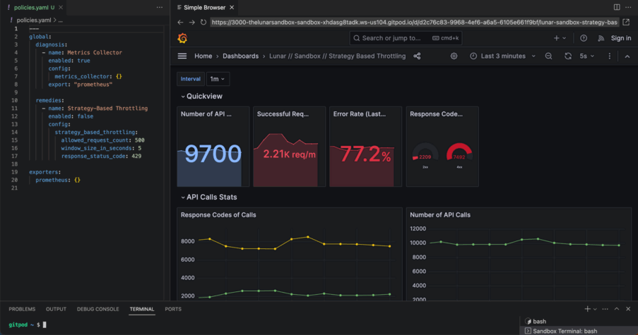

<p align="center">
    
    
</p>

[](https://hub.docker.com/r/lunarapi/lunar-proxy)
[](https://opensource.org/licenses/MIT)
[](https://docs.lunar.dev/)

Lunar.dev’s mission is to enable optimization and control of third-party API consumption in production environments. Lunar is a lightweight tool that empowers DevOps and engineering teams to centralize consumption, gain insight and visibility into usage patterns and costs, and utilize out-of-the-box policies.

<p align="center">
    
</p>

# ⚡️ Quick Start

## Installation

There are two main components to Lunar:

#### Interceptor

Intercepts API calls and sends them to the proxy. To install interceptors, see [here](https://docs.lunar.dev/installation-configuration/interceptors/#supported-languages) and choose the language you are using to make API calls to see its installation instructions.

#### Lunar Proxy

Receives intercepted API calls and forwards them to the API, applying any policies that you have defined. See [here](https://docs.lunar.dev/installation-configuration/proxy/installation) for installation instructions.

Using an interceptor is recommended, as it includes failsafe mechanisms and some additional features.
However, it is also possible to use Lunar without an interceptor. See [here](https://docs.lunar.dev/installation-configuration/interceptors/Agentless) for more information.

### Configuration

#### Configure the policies.yaml file

After validaing the succussful installation of both Lunar Interceptor and Lunar Proxy, configure a remedy policy for optimizaing your current API consumption. 

Edit your `policies.yaml` file with the following `strategy-based-throttling` plugin configuration. 

```yaml title="/etc/lunar-proxy/policies.yaml"
global:
    remedies:
      - name: Strategy Based Throttling Quick Start
        enabled: true
        config:
          strategy_based_throttling:
            allowed_request_count: 100
            window_size_in_seconds: 60
            response_status_code: 429
```

In the above example, the plugin will enforce a limit of 100 requests per minute for all requests. If the limit is exceeded, the plugin will return a 429 HTTP status code.

#### Apply Policy

After making changes to your local `policies.yaml` file, use the `apply_policies` command to apply the new policies. 

```bash
docker exec lunar-proxy apply_policies
``` 

### Demo

Check out our demo video for a quick start [here](https://youtu.be/ObJDfbSB5N8).

### Lunar Sandbox

To try out Lunar without installing anything, check out our [sandbox](https://lunar.dev/sandbox).

## Getting Help

For any questions, feel free to reach out to us at [info@lunar.dev](mailto:info@lunar.dev).

## Testing / Linting

### Proxy

To run tests:

```
cd proxy/integration-tests
pipenv install --dev
pipenv run behave
```

Linting is described [here](https://github.com/TheLunarCompany/lunar/blob/main/readme-files/LINTING.md).

### Interceptor

To run tests:

```
cd interceptors/integration-tests
pipenv install --dev

export CLIENT_LANGUAGE=python CLIENT_VERSION=3.10  # For Python tests
# OR
export CLIENT_LANGUAGE=java                        # For Java tests

pipenv run behave
```
