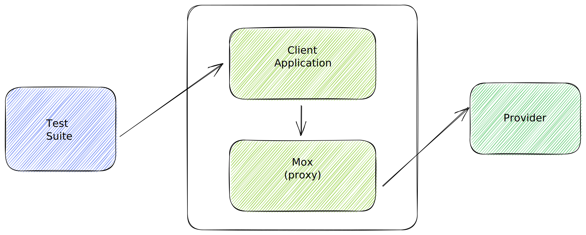

# Lunar Python Interceptor Integration Tests

A behavior-driven-design (BDD) test suite aimed at ensuring Lunar Interceptor is functioning according to its required specification.

## Architecture



## Testing Strategy

- Testing is done from the outside (i.e. blackbox testing). See chart above.
- Testing encapsulate the usage site in a container which is called _client_. Each client runs with a specific language and version (e.g. Python 3.10).
- The functionality of Lunar Proxy is mocked, by using _mox_. The path that the _client_ makes an HTTP call to is set up in _mox_ as well in order to emulate potential early response from Lunar Proxy.

## Running Locally

1. Navigate to `interceptor-integration-tests`
2. Install dependencies:

```shell
pipenv install --dev
```

3. Run the test suite for the desired client:

```shell
CLIENT_LANGUAGE=python CLIENT_VERSION=3.10 pipenv run behave
```

or

```shell
CLIENT_LANGUAGE=java pipenv run behave
```

Note that java client does not support different versions at the moment.
