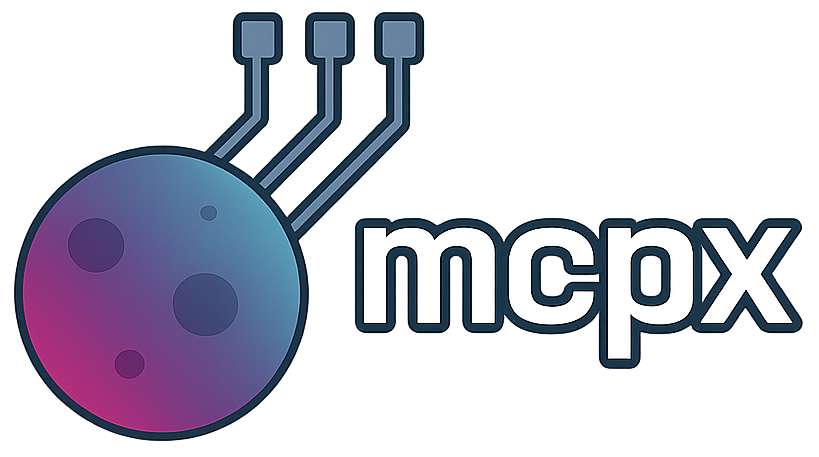
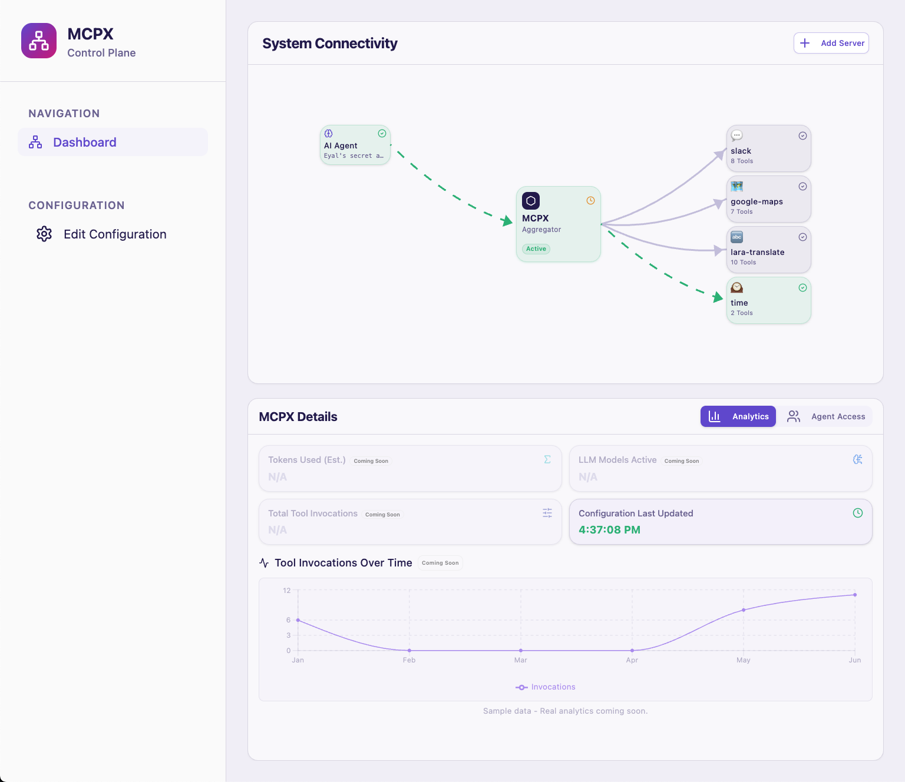

## Introduction

Lunar MCPX is an MCP server which serves as an aggregator for other MCP servers. Its primary goal is to simplify the integration and management of multiple MCP servers dynamically. By using MCPX, developers can easily manage connections to various MCP-compatible services through simple configuration changes, enabling rapid integration with no coding involved.

MCPX provides:

- Dynamic MCP servers dispatch
- Zero-code integration with MCP services via JSON configuration
- Unified API interface to multiple MCP services
- A remote-first approach

## Check our MCPX Demo video 

## Tip
This repository helps you get up and running quickly. For detailed feature guides, architecture, and advanced options, head to the [official docs](https://docs.lunar.dev/next/mcpx/get_started).

## Getting Started

You can run Lunar MCPX locally or via Docker.

Before you start: it's assumed you already have an MCP-compatible client. If not, [Claude Desktop](https://modelcontextprotocol.io/quickstart/user) is a good place to start.

- **Run with Docker:**  
  Use the [Official Docker Image Guide](https://docs.lunar.dev/mcpx/get_started)

## MCPX Control Plane

 

The Control Plane helps you inspect live traffic and manage your MCPX instance.
Setup instructions are available [here](https://docs.lunar.dev/mcpx/control_plane/).

## Connecting to MCPX
 
Once MCPX is running, you can connect a client using one of the following methods:

1. [Use your own client](https://docs.lunar.dev/mcpx/connect_with_your_client)
2. [Connect with Claude Desktop](https://docs.lunar.dev/mcpx/connect_with_claude)
3. [Connect with Cursor](https://docs.lunar.dev/mcpx/connect_with_cursor)