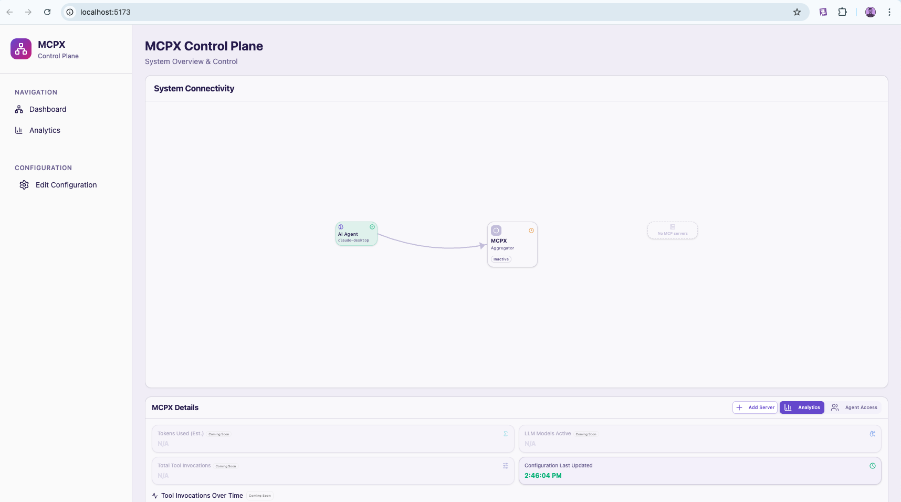

# MCPX Control Plane [beta]

MCPX supplies a graphic Control Plane in order to help users investigate their MCP traffic and manage their MCPX instance. Note that this feature is still in beta mode.

## Installation

Below are instructions to combine the containerized version of MCPX with the Control Plane. The Control Plane will be containerized soon to facilitate this. For now:

1. Clone this repo and navigate into the `/mcpx` directory.
2. Install dependencies with `npm run build:deps && npm install`
3. Bring up the Webserver (linking between MCPX and the UI) with `npm run start:webserver`
4. Bring up the Control Plane's UI with `npm run start:ui`
5. Bring up a containerized MCPX instance with `docker run --rm --name mcpx -p 9000:9000 -e ENABLE_HUB=true -e WEBSERVER_URL="http://host.docker.internal:9001" us-central1-docker.pkg.dev/prj-common-442813/mcpx/mcpx:latest`.
6. Navigate to `http://localhost:5173/` - you should see a screen similar to the following:

 

## Usage

At this point, you may:

- Add a target server using the "Add Server" button
- Connect to MCPX (see [here](./README.md#connecting-to-mcpx))
- Use tools and see basic statistics

More to follow soon!
