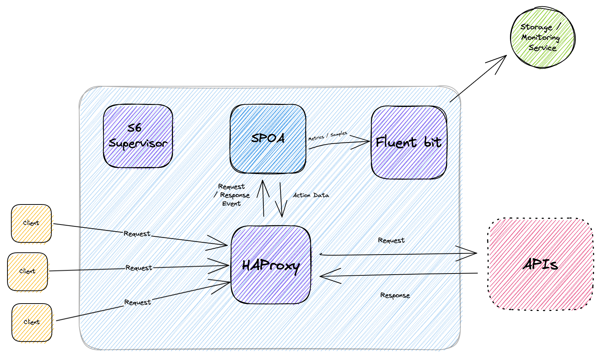

# Lunar Proxy


- [Lunar Proxy](#lunar-proxy)
- [Overview](#overview)
- [How does it work?](#how-does-it-work)
- [Installation](#installation)
  - [Endpoints Discovery](#endpoints-discovery)
- [Development](#development)
  - [Tests](#tests)
  - [Linting](#linting)

# Overview

Easily manage and optimize 3rd party API consumption.
There are 3 supported modes of operation:

1. Proxy - forwards outgoing traffic in passive mode.
2. Diagnose - observe and analyze traffic.
3. Remediate - apply plugins on traffic and enjoy.

# How does it work?

Lunar Proxy is a forward proxy for your API clients.



Requests sent to Lunar Proxy are forwarded to the API provider.

When a **diagnosis** policy is defined on an endpoint, its transaction data is sent to a [Stream Processing Offload Agent](../readme-files/SPOA.md) and processed asynchronously to generate insightful data.

A **remedy** policy defines a remediation policy for API consumption, if applied and lunar returns an early response then Lunar Proxy will add an indication header `x-lunar-generated` with the value `true`.

For example, a `response_based_throttling` remedy blocks clients from overconsuming APIs and causing stricter quotas, by storing and serving rate limit responses for the rest of the rate limit window.
A `caching` remedy allows responses to be cached according to request similarity.

Even when no policies are defined, Lunar Proxy forwards traffic seamlessly and generates Discovered Endpoint Metrics - latency and status code metrics grouped by endpoint.

# Installation

To install our proxy you simply need to:

1. Obtain `ssh` access to this repository
2. execute the following command within your terminal

```shell
git clone git@github.com:TheLunarCompany/lunar-proxy.git && cd lunar-proxy

docker build -t lunar-proxy -f ./Dockerfile .
docker run --rm -p 8000:8000 -p 8081:8081 -e TENANT_NAME="yourChoice" -v $(pwd)/rootfs/etc/lunar-proxy:/etc/lunar-proxy --name lunar-proxy lunar-proxy
```

## Endpoints Discovery

You may inspect the traffic passing through Lunar Proxy by using the Lunar Discovery utility:

```bash
docker exec -it lunar-proxy bash -c "cat /etc/fluent-bit/plugin/discovery-aggregated-state.json"
```

It will print a JSON object with all the endpoints that Lunar Proxy has handled traffic for. By piping [`jq`](https://stedolan.github.io/jq/) at the end of that command, the prettified output might look like this:

```json
{
  "GET:::httpbin.org:::/status/{code}": {
    "min_time": 1675789662939,
    "max_time": 1675789754393,
    "count": 5,
    "status_codes": {
      "200": 1,
      "201": 1,
      "402": 3
    },
    "average_duration": 283
  }
}
```

# Development

## Tests

Tests use [Behave](https://behave.readthedocs.io/en/stable/).
Feature descriptions are under [integration_tests/features/](integration_tests/features/)

To run tests:

```
pipenv install --dev
pipenv run behave
```

## Linting

See [here](../readme-files/LINTING.md).
