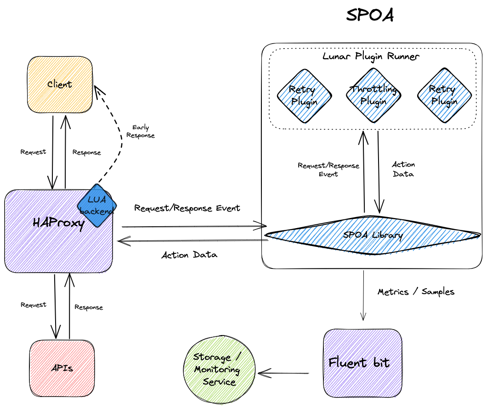

# Lunar SPOA

## Architecture

    

## How to write a plugin

Coming soon...

## Plugin Runner

The [Plugin Runner](../spoa_python/plugin_runner/plugin_runner.py) runs plugins according to configured policies.
 Each policy is set on a method and endpoint (e.g. `GET` and `httpbin.org/json`), and has a policy type and configuration.

When a request arrives on a method and endpoint with a set policy, the policy's plugins will run in order.

## Plugin

A plugin is a subclass of `spoa_python.plugins.Plugin` which implements the `on_request` and `on_response` methods.

These methods receive the policy's configuration as an argument (`config`), a transaction id with the same value for the request and response (`id`), as well as arguments describing the request/response ([Events](#events)).
They return an [`Action`](#actions).

## Events

| Event | Arguments | Example | 
| ----------- | ----------- | ----------- |
| <pre><b>on_request</b></pre> | <pre><b>id: </b>str, <b>config</b>: [PolicyConfig](../spoa_python/plugin_runner/policy_configs.py), <b>method</b>: str, <b>path</b>: str, <b>query</b>: str, <b>headers</b>: str, <b>body</b>: str</pre> | <pre>$ curl http://localhost/json --header "Host: httpbin.org:443"  Values: <b>id = </b>"f2eb8567-b6c4-4c30-b927-0eb9d8012aa5" <b>method = </b>"GET" <b>path = </b>"/json" <b>query = </b>"var=2" <b>headers = </b>   "Host: httpbin.org    Accept: */*    User-Agent: curl/7.79.1" <b>body = </b>""</pre> |
| <pre><b>on_response</b></pre> | <pre><b>id</b>: str, <b>config</b>: [PolicyConfig](../spoa_python/plugin_runner/policy_configs.py), <b>status</b>: int, <b>headers</b>: str, <b>body</b>: str</pre> | <pre>$ curl http://localhost/json --header "Host: httpbin.org:443"  Values: <b>id = </b>"f2eb8567-b6c4-4c30-b927-0eb9d8012aa5" <b>status = </b>200 <b>headers = </b>   "Content-Type: application/json    Content-Length: 429    &lt;rest of headers&gt;"  <b>body = </b>'{    "slideshow": {      "author": "Yours Truly",      "date": "date of publication",      &lt;rest of body&gt;  }'</pre> |

## Actions

Currently supported actions are:

| Action | Arguments | Details |
| ----------- | ----------- | ----------- |
| **`NoOpAction`** | None | Do nothing |
| **`EarlyResponseAction`** | `status`, `headers`, `body` | Return a response without reaching the provider |
